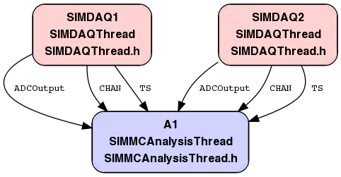

# Histogramming Example

## Important Classes
  * GRIHist1DWidget
  * GRIHist1DGridWidget
  * GRIHist1DGridScrollWidget
  * GRIHist2DWidget

## Summary

This example is similar to the simulator example, except histograms are generated
and displayed.  There are two DAQ threads which produce simulated signals.  There
is one analysis thread which reads the data and updates histograms.  The GUI elements
are created in main.cpp.

## Application Graph

